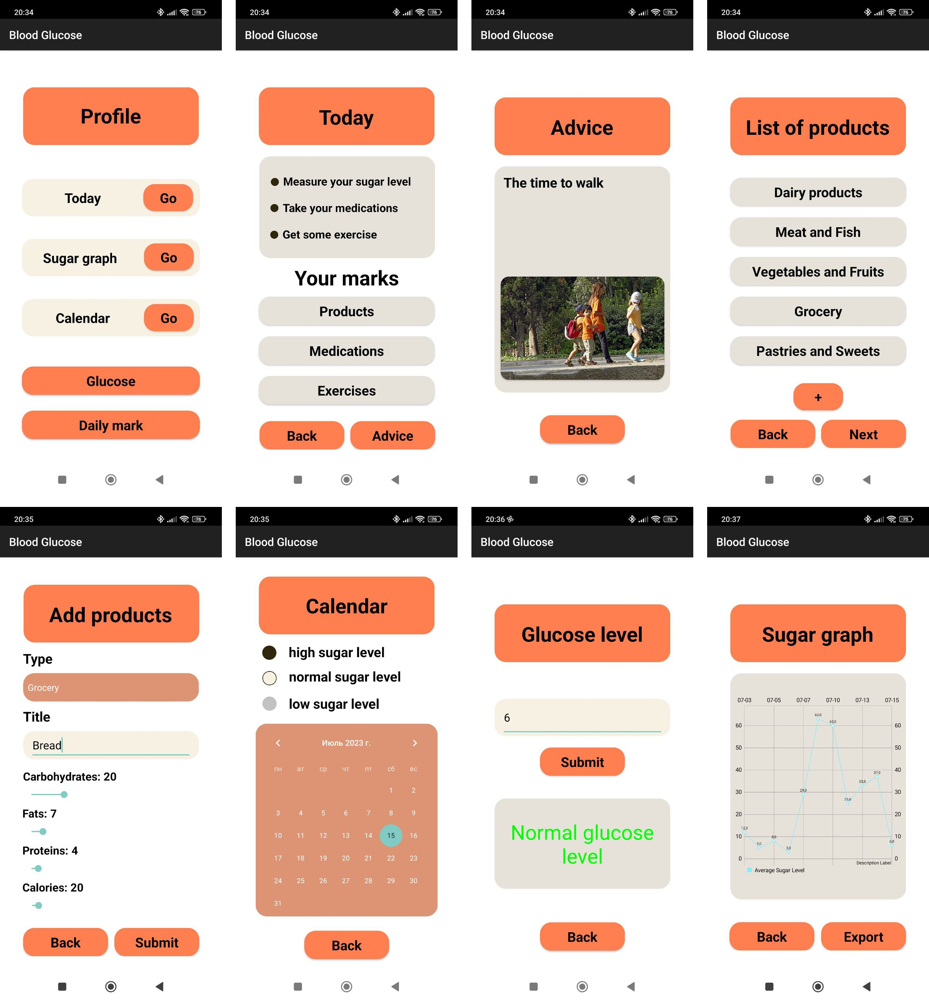

# Blood Glucose 🩸

## Description

Blood Glucose is an Android mobile app for people with diabetes to control their blood sugar levels.
The app allows to add blood sugar data and monitor one's condition on graphs and export data to medical professionals.

## Demo

### Gif

### Screenshots

## How to use the app

- On `Profile` screen you can choose different sections: `Today`, `Sugar graph`, `Calendar`, `Glucose` & `Daily mark`. 
- On `Today` screen you can see your marks about today's products, medications & exercises. Also you can check daily advice.
- On `Sugar graph` screen you can see your average blood sugar level for the last 7 days. There is an option to export graph to csv file and send it to your doctor.
- On `Glucose` screen you can add new blood sugar level mark. After submitting you will see if your blood sugar level is normal or not: high or low.

## Features list

- [x] Glucose tracking
- [x] Food tracking
- [x] Exercise tracking
- [x] Medication tracking
- [x] Showing daily tips
- [x] Let user mark his own food/exercises/medications
- [x] Export glucose statistics to Excel
- [ ] Implement user accounts
- [ ] Export food/exercises/medications to Excel

## Installation

### Prerequisites

- Android 11 R (API 30) or higher

### Installation

- [APK](https://drive.google.com/file/d/1Pk_SiEJBOoBQEd9GFt21MID9YVSRjs3p/view?usp=drive_link)

- Git clone the repository in Android Studio
> git clone https://gitlab.pg.innopolis.university/blood-glucose/blood-glucose-app.git

## Technology stack

    

## Contact

If you have any questions, please contact
[e.bobkunov@innopolis.university](mailto:e.bobkunov@innopolis.university)

## Team members _(For customer)_

- Evgeny Bobkunov
- Anna Rylova
- Viktoria Patrina
- Julia Martynova
- Michael Avrutskiy
